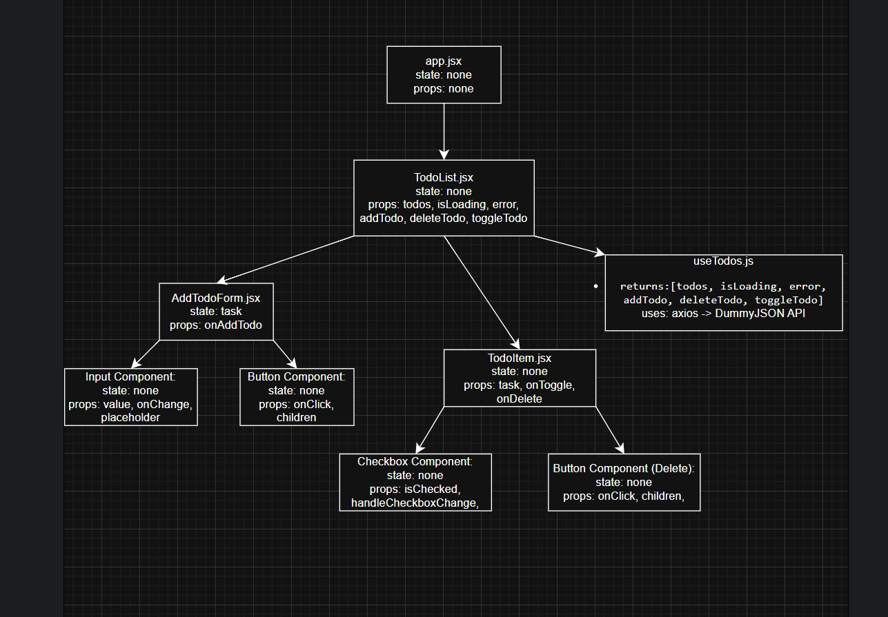

## Архітектура

## State colocation
-useTodos зберігає глобальний стан завдань (todos, isLoading, error).

-AddTodoForm має локальний стан task для введення тексту.

-TodoItem отримує task через props і змінює стан через callback-и (onToggle, onDelete).

-TodoList не має власного стану — лише передає дані та callback-и між компонентами.

## Acceptance Criteria
-Додавання нового завдання через AddTodoForm.

-Позначення завдання як виконаного (onToggle).

-Виконані завдання відображаються перекресленими (className="completed").

-Видалення завдань (onDelete).

-Використано кастомний хук useTodos для запитів (GET, POST, PUT, DELETE).

-App лише рендерить TodoList, без власного стану.

-Дані передаються вниз через props і вгору через callback-и.
